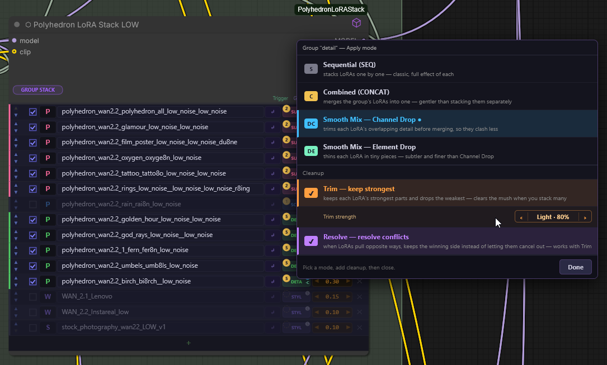
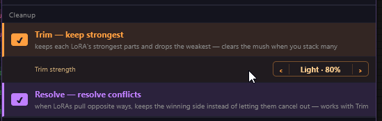
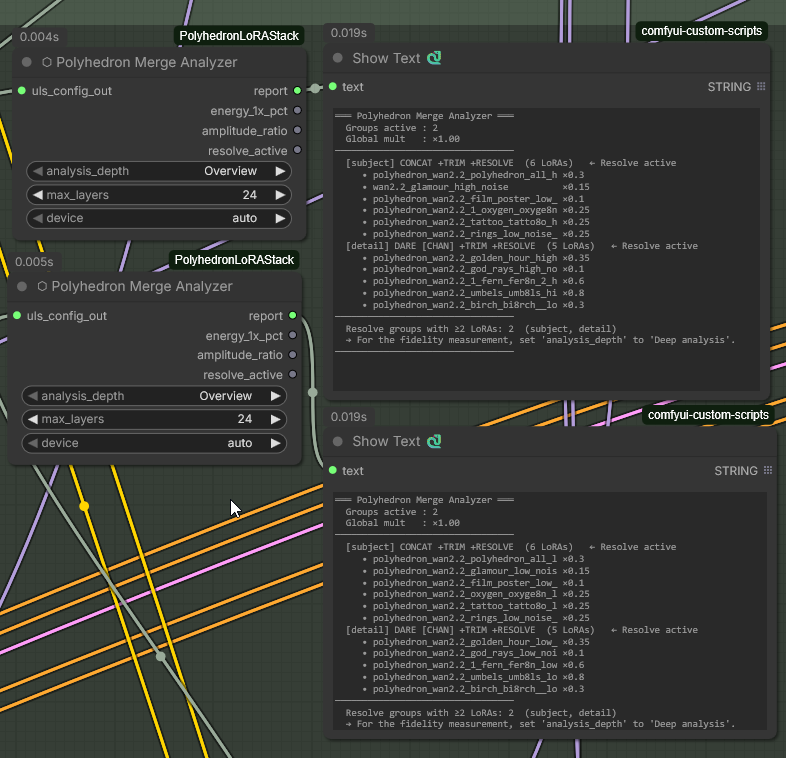

# ⬡ Polyhedron LoRA Stack

**Group-aware LoRA management for ComfyUI — built for workflows that run 10–25 LoRAs at once.**

Most LoRA loaders are fine for two or three LoRAs. Stack fifteen and you get the familiar
multi-LoRA interference: washed-out detail, concepts cancelling each other, no way to see what is even active.
Polyhedron LoRA Stack treats a big LoRA stack like a total-conversion mod for your model —
organised in semantic groups, applied in a defined order, with per-group merge modes and two
cleanup switches that fight that interference directly.

Model-agnostic backend: WAN 2.1 / 2.2, FLUX, SDXL, SD 1.5 — no model-specific assumptions.



---

## Highlights

- **Group system** — `acc → style → scene → motion → subject → detail → custom`, applied broad-to-specific, with optional per-group ordering
- **Per-group merge modes** — Sequential (SEQ), Combined (CONCAT), Smooth Mix (DARE) with Channel-Drop and Element-Drop variants; deterministic seeds, reproducible runs
- **Cleanup switches: Trim & Resolve** — magnitude-based channel pruning and TIES sign-election against multi-LoRA interference (see below)
- **⬡ Merge Analyzer** — a passive node that shows what is actually being merged and measures the Resolve repack fidelity (energy, cosine, amplitude)
- **Thumbnails & previews** — hover popups with image/video, Civitai hash-based fetch (SFW-strict), editable metadata
- **Trigger-word management** — read from `.uls-meta.json`, `.txt` or the safetensors header, one-click insert into your prompt node
- **Quality-of-life** — Token Counter for WAN's 512-token limit, trigger Inspector, central Model Switch, dual HIGH/LOW workflow support, fast cancel via ComfyUI's red ✕
- **Persistent settings** — group assignments, modes and cleanup toggles are serialized into the workflow and survive reloads and full ComfyUI restarts

---

## The nodes

| Node | Purpose |
|---|---|
| ⬡ Polyhedron LoRA Stack | Main node: group-organised LoRA rows, per-group merge modes, cleanup switches |
| ⬡ Polyhedron LoRA Engine | Companion for acceleration LoRAs (Lightning, FusionX, CausVid, LightX2V) — flat list, one global mode |
| ⬡ Polyhedron Merge Analyzer | Passive: live overview of the configured merge + Resolve fidelity measurement |
| ⬡ Polyhedron LoRA Inspector | Passive: checks the trigger words of all active LoRAs against your prompt |
| ⬡ Polyhedron Token Counter | UMT5-XXL token estimate vs. WAN's hard 512-token limit, with actionable report |
| ⬡ Polyhedron Select Model Switch | Central model selector (6 slots), docks onto any COMBO loader input |
| ⬡ Polyhedron Wan Bridge (→ / ←) | Type bridges MODEL ↔ WANVIDEOMODEL for kijai's WanVideoWrapper |
| ⬡ Polyhedron Wan Frame Inflate / Pick Frame | Workaround for kijai issue #1827 (T2I LoRAs without effect) |
| ⬡ Polyhedron Sigma Curve / Dual Sigma Curve | Model-agnostic SIGMAS generators; Dual = HIGH/LOW split with exact handoff |
| ⬡ Polyhedron Noise Schedule | Deprecated original sigma node, kept for backwards compatibility |

---

## Merge modes (per group)

- **Sequential (SEQ)** — classic stacking via ComfyUI's native cached loader. Default, always works.
- **Combined (CONCAT)** — rank concatenation; mathematically identical to SEQ, gentler float path.
- **Smooth Mix (DARE)** — CONCAT plus a Bernoulli mask. *Channel Drop* removes whole rank
  channels (LoRA-aware), *Element Drop* removes single tensor elements (classic DARE paper).
  Density auto-scales with group size; the seed is derived deterministically from LoRA names
  and weights, so the same workflow always produces the same merge.

## Cleanup switches — Trim & Resolve

Two independent modifiers on top of CONCAT/DARE (greyed out under SEQ, where they cannot apply):



- **Trim — keep strongest.** Deterministically drops each LoRA's weakest rank channels
  (by contribution magnitude) *before* merging. This is the direct counter to the
  "many quiet LoRAs → grey fog" effect. Strength is adjustable per group
  (`Auto · Gentle 90% · Light 80% · Medium 70% · Strong 60% · Max 50%`).
- **Resolve — resolve conflicts.** TIES sign-election across competing LoRAs: per weight,
  the majority direction wins and only agreeing LoRAs are averaged, then the result is
  repacked to low-rank via truncated SVD so it hits the same hand-off path.

> **Recommended Trim working range: 70–80 % (Medium/Light).** `Max · 50%` cuts into the
> mid/quiet rank channels where a concept's *distinguishing features* live — the known
> failure mode is concept → silhouette, with the base model filling the gap with its own
> prior. Use Max only on extreme stacks (15+) and check the output visually.
> The Merge Analyzer warns about this in its report when Trim is active.

All toggle states and the Trim strength **persist**: they are saved into the workflow and
restored after reload and full ComfyUI restarts.

## ⬡ Merge Analyzer

A passive measurement node — connect `uls_config_out`, no model patching. **Overview** is
instant (groups, LoRAs, weights, modes, cleanup status); **Deep analysis** loads the LoRAs
and measures the Resolve repack per layer (energy at 1×/2×/4× rank, cosine, amplitude ratio),
with live progress in the console. Use one Analyzer per Stack (HIGH + LOW).



---

## Installation

**ComfyUI-Manager (recommended):** open the Manager, search for **"Polyhedron LoRA Stack"**
and install. Missing-node detection in shared workflows resolves through the
[Comfy Registry](https://registry.comfy.org) entry as well.

**comfy-cli:**
```bash
comfy node install polyhedron-lora-stack
```

**Manual:**
```bash
cd ComfyUI/custom_nodes
git clone https://github.com/PolyhedronAI/ComfyUI-PolyhedronLoRAStack.git
# Restart ComfyUI
```

**Dependencies: none.** The nodes run on what ComfyUI already ships. `Pillow` and `requests`
are only needed for the optional standalone CLI preview generator (`uls_preview_gen.py`):
```bash
pip install Pillow requests
```

---

## Dual-noise workflow pattern (WAN 2.2)

Use **two Stack nodes side by side** — one per noise path — and configure both identically:

```
[UNet HIGH] → [Engine HIGH] → [Stack HIGH] → [Sampler HIGH]
[UNet LOW]  → [Engine LOW]  → [Stack LOW]  → [Sampler LOW]
```

The same single-line pattern works for FLUX, SDXL and SD 1.5.

---

## Preview images and trigger words

Place files alongside your `.safetensors`:

| File | Purpose | Notes |
|---|---|---|
| `mylora.jpg` / `mylora.preview.png/.mp4/.gif` | Preview | Shown as thumbnail / hover popup |
| `mylora.txt` | Trigger words | One per line or comma-separated. Read-only. |
| `mylora.uls-meta.json` | Editable metadata | Created automatically when editing in the UI |

Trigger-word resolution priority:
`.uls-meta.json` (user-curated) → `.txt` → safetensors header → filename fallback.

"Fetch from Civitai" reads the `sshs_model_hash` from the safetensors header and pulls the
preview image and trigger words from the Civitai API (SFW-strict filtering, capped downloads).

---

## Local API routes

| Route | Purpose |
|---|---|
| `GET  /uls/list` | All LoRAs with preview flags |
| `GET  /uls/metadata?lora=<name>` | Per-LoRA metadata as JSON |
| `GET  /uls/preview/image` / `…/video` | Preview bytes (video with range support) |
| `GET/POST /uls/groups` | Group assignments |
| `POST /uls/triggers` | Save trigger words (writes `.uls-meta.json`) |
| `GET/POST /uls/group_modes` | Per-group merge modes |
| `POST /uls/civitai_fetch` | Hash-based Civitai preview + trigger download |

---

## Documentation

The full illustrated user manual (34 pages, every node, panel and switch) ships in this
repository: [`docs/Polyhedron_LoRA_Stack_Documentation_v125.pdf`](docs/Polyhedron_LoRA_Stack_Documentation_v125.pdf)

## Links

- Civitai: <https://civitai.red/user/Polyhedron_AI>
- Patreon: <https://patreon.com/c/polyhedron_ai>

## License

Code: [MIT](LICENSE). The user documentation PDF in `docs/` is © Polyhedron, all rights reserved.
