# ⬡ Polyhedron Suite

**One pack, two halves: media in and out, and group-aware LoRA management.**

| Part | Nodes |
| --- | --- |
| [Media I/O](#-polyhedron-media-loader--polyhedron-save) | ⬡ Polyhedron Media Loader · ⬡ Polyhedron Save |
| [LoRA Stack](#-polyhedron-lora-stack) | ⬡ Polyhedron LoRA Stack · LoRA Engine · LoRA Inspector · Token Counter · Select Model Switch · Merge Analyzer · Wan Frame Inflate · Pick Frame · Sigma Curves · Wan Bridge |

Installed as one custom-node pack — the node names, the package id
(`polyhedron-lora-stack`) and every saved workflow are unchanged.

---

# ⬡ Polyhedron Media Loader & ⬡ Polyhedron Save

The **Media Loader** is the pack's one-stop input node: images, image
batches, videos and audio from any folder on your machine, with a visual
tile browser, single-file and batch modes, video/audio trimming and a
mask-aware image path. The **Save** node is its counterpart on the way
out: one node for stills, image sequences, videos (with muxed audio) and
masks, with presets, metadata embedding and date-based file naming.

They are built to work as a pair — what Save writes, the Loader reads
back, including masks.

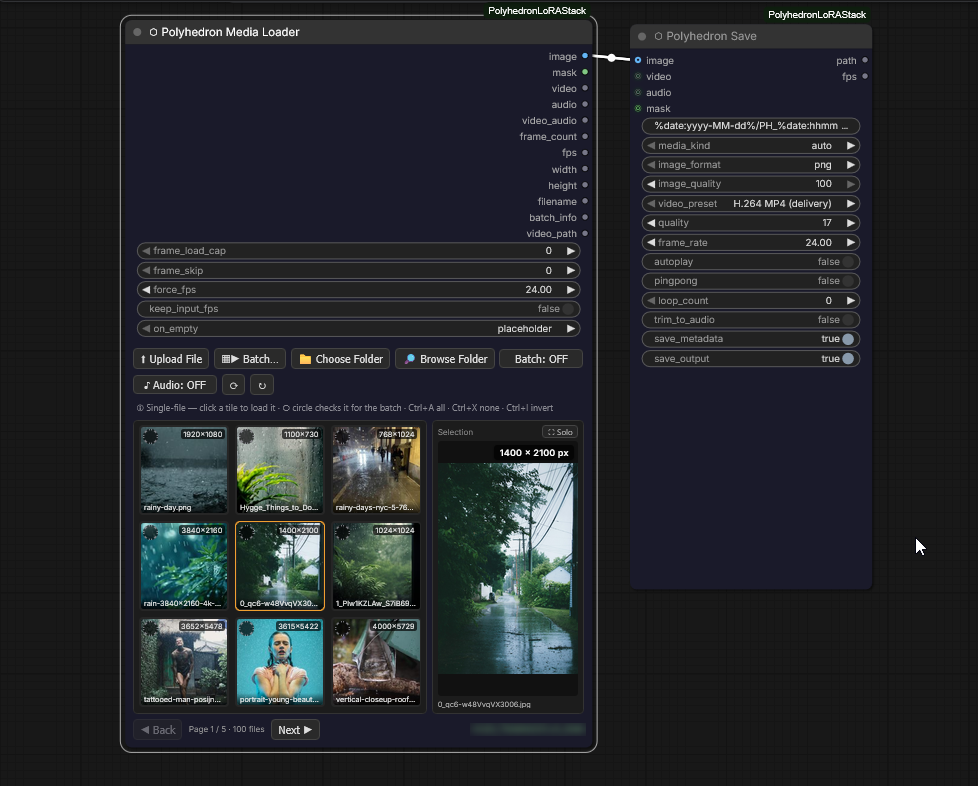

## At a glance — every output pin

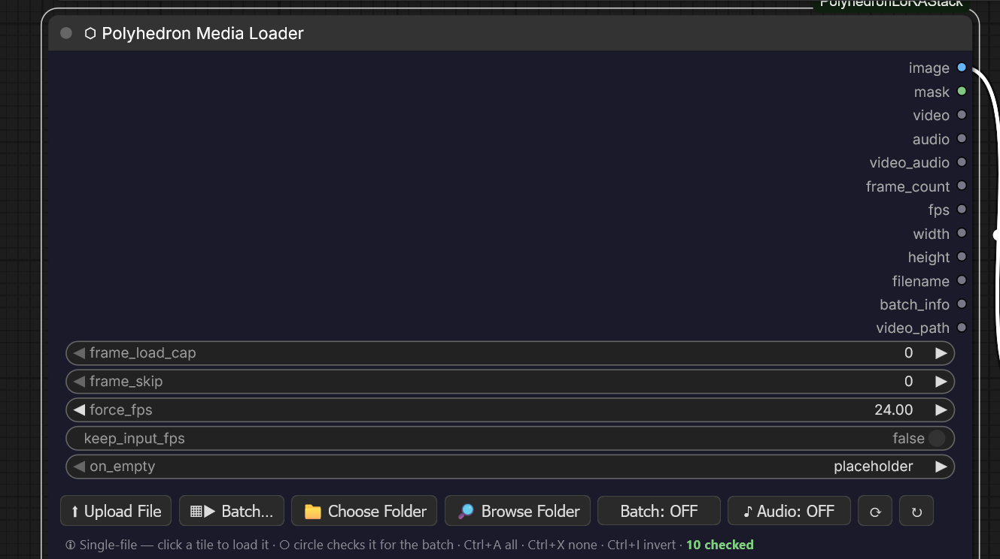

| Pin | Type | Carries |
| --- | --- | --- |
| `image` | IMAGE `[N,H,W,3]` | The decoded frames — `N` = 1 for a still, the frame count for a video or batch. An audio-only pick emits a small placeholder frame so the graph keeps running. |
| `mask` | MASK `[N,H,W]` | The still's **alpha** (opaque → 0, like core LoadImage). A **grayscale still without alpha carries its luminance** as the mask, white → 1 — that is what makes a saved mask load back as the same mask. Plain video: blank; alpha-bearing video (VP9-alpha WEBM, ProRes 4444, transparent GIF): a real per-frame mask. Details in section 6. |
| `video` | VIDEO | A single video file **losslessly with its own audio**; a trimmed video is re-encoded from the sliced frames with its sound cut to the same window; an image batch or a still-with-audio becomes a synthesized clip. `None` only when there are no frames. |
| `audio` | AUDIO | The paired audio, decoded and trimmed (section 4). `None` when nothing is paired. |
| `video_audio` | VIDEO | The visual's frames muxed with the paired audio — wire it into a video save for an mp4 with a sound track. `None` when nothing is paired. |
| `frame_count` | INT | `1` for a still. |
| `fps` | FLOAT | `0.0` for a still; native or forced for a video. |
| `width` / `height` | INT | The decoded frame size. |
| `filename` | STRING | The loaded file's name; empty in sequence mode. |
| `batch_info` | STRING | The live batch counter (section 5): `Batch 0023 / 1334` per firing, `Batch 1334 frames (one pass)`, or `Single: <name>`. |
| `video_path` | STRING | The loaded file's **full path** — feeds the Batch Pipeline Source; empty in modes without a single source file. |

The five widget rows below the pins are the video levers
(`frame_load_cap`, `frame_skip`, `force_fps`, `keep_input_fps` — section
3) and the empty-state switch (`on_empty` — section 3).

---

## 1. Folders & files (Media Loader)

The loader reads from a **pinned folder** — any folder on the machine
running ComfyUI, not just the ComfyUI input directory. The current pin is
shown at the bottom right of the node.

### Picking a folder

**📁 Choose Folder** opens the in-canvas picker:

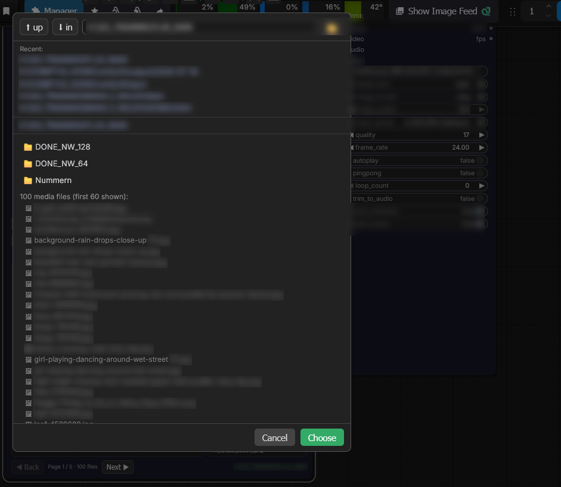

When the current folder has **no subfolders**, the picker says so —
**Choose** then pins the folder you are looking at:

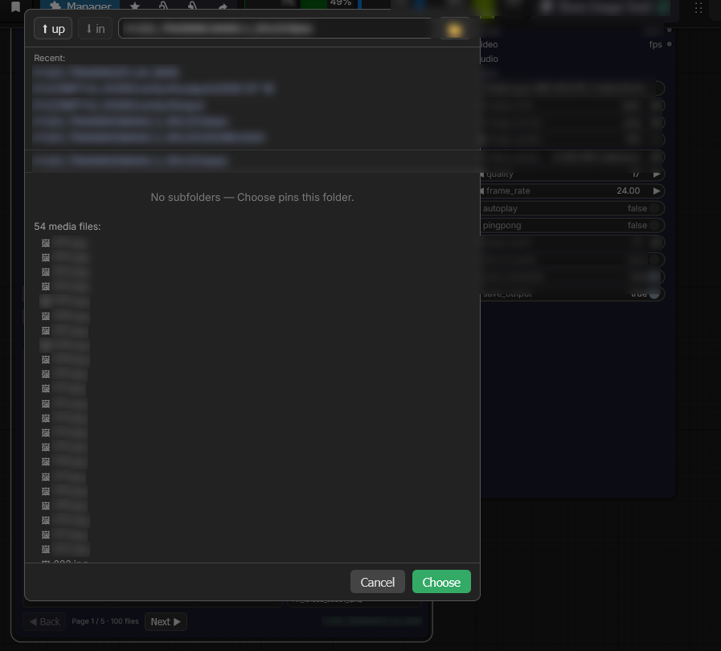

- Navigate with **⬆ up / ⬇ in**, the subfolder list, or the recents.
- The picker **peeks into the current folder**: below the subfolders it
  lists the folder's own media files (count + sorted names with kind
  icons), so you can see what a pin would load before you commit.
- The **address bar is live**: type or paste a full path and hit
  **Choose** — the typed path is validated and pinned directly, no
  Enter-then-click detour. Unreadable paths say so and keep the picker
  open.
- The **yellow folder button** inside the picker opens the native
  Windows dialog — as a **file** dialog: you see the folder's contents
  like in Explorer, click **any file** inside your target folder, and
  that file's **folder** gets pinned and the file itself is selected and
  loaded right away. The dialog's OK is the
  confirmation; the pick applies immediately. (Windows cannot show
  files in its folder-pick mode — that's an OS limit, which is exactly
  why the dialog works file-first.)

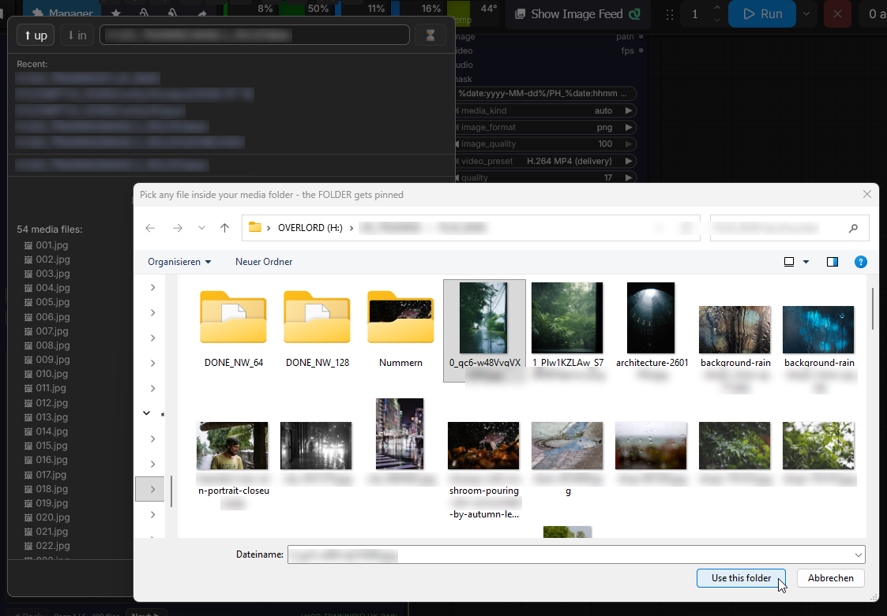

**🔎 Browse Folder** opens the large, filterable list view for visually
hunting through long folders — see *Live preview on hover* in section 2.

### Staying fresh

- **⟳ Re-read** re-reads the pinned folder from disk — new files appear,
  your current page and checkmarks stay.
- **Silent auto-refresh**: when the ComfyUI window regains focus (a
  render finished, you copied files in from Explorer), the loader probes
  the folder in the background and re-renders only if something actually
  changed. No flicker, no clicks.
- **↻ Reset** jumps back to the ComfyUI input folder.

### Getting files in

- **⬆ Upload File** uploads into the ComfyUI input folder.
- **Drag & drop** raises **two drop zones** over the node — aiming at one
  is the choice, nothing needs to be known or held down:

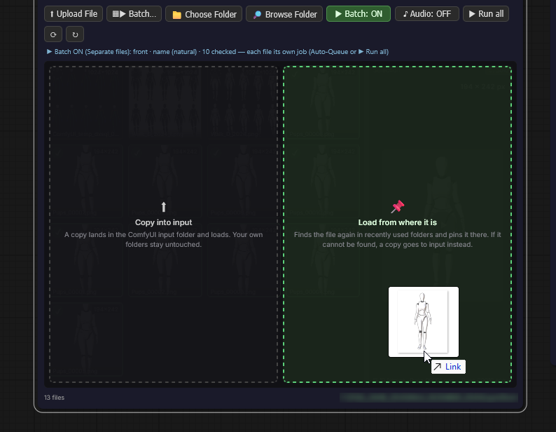

  - **⬆ Copy into input** (left): a copy lands in the ComfyUI input
    folder and loads. Your own folders are never written to.
  - **📌 Load from where it is** (right): selects the file and pins the
    folder it already lives in — the whole folder appears in the grid,
    nothing is copied. When the drag carries the file's path (a dropped
    path text, a `file:///` URI, or the desktop client) that path is
    used directly; otherwise the file is **found again** by name, size
    and timestamp in recently used folders. If it cannot be found, a
    copy goes to input instead — and the node says so.

  The zones exist only while a drag is in flight; the node gains no
  permanent buttons. The zone under the pointer lights up, so the aim is
  confirmed before release. A multi-file drop copies every file and
  loads the first — the status line names the count.
- A **busy ring** with a phase label ("Uploading…", "Reading folder…")
  covers the node while slow operations run — visible in every view,
  including Solo.

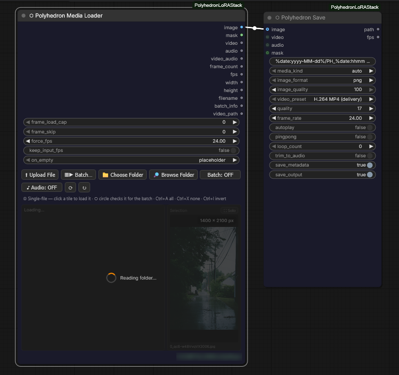

---

## 2. Selection & views

The lower half of the node is the **tile grid**: one thumbnail per media
file in the pinned folder, each with a **resolution badge** (width ×
height), a **kind icon** and the file name. Large folders are split into
pages — the **pager** at the bottom shows the current page and the total
file count, **◀ Back / Next ▶** flip through.

### Single-file mode

Click a tile and that file is **loaded immediately** — it becomes the
node's output and appears in the **Selection panel** on the right, with a
large preview, the pixel dimensions and the file name. This is the
everyday mode: one file in, one file out.

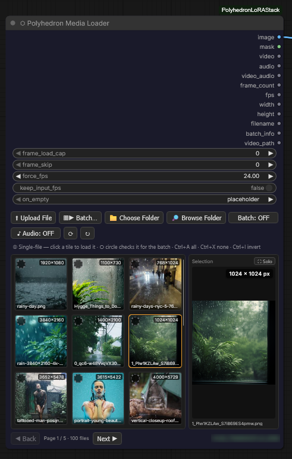

### Live preview on hover

Nothing has to be loaded to be judged — pointing at it is enough:

- **Images** pop a large preview over the node, with the pixel size as a
  badge. Move off the tile and it vanishes.

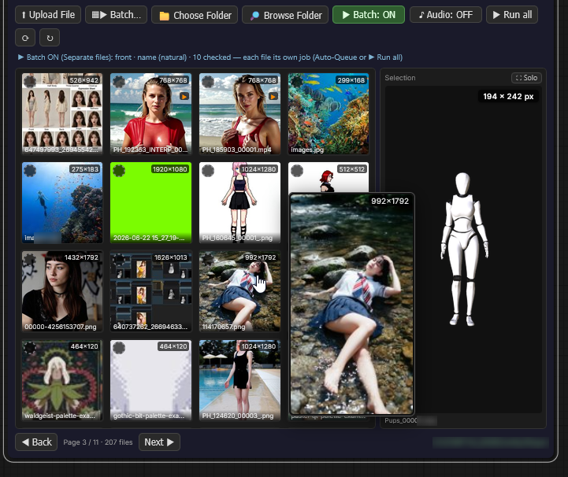

- **Videos play right inside their tile** — muted, looping, starting the
  moment the pointer arrives and stopping the moment it leaves. The ▶
  badge marks them in the grid.
- **Audio plays on hover** — one clip at a time; a new hover, leaving the
  tile, or clicking anywhere stops the previous one. (The very first
  play on a fresh page may need one click first — that is the browser's
  autoplay policy, not the node.)

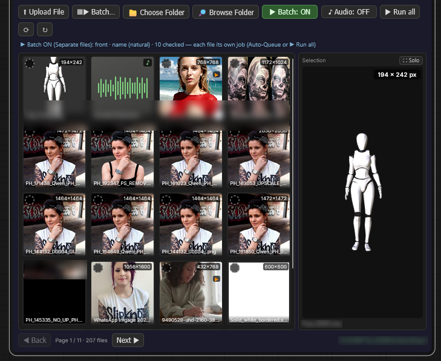

The same rules follow into **🔎 Browse Folder**, the large list view for
hunting through long folders: every row carries a thumbnail, name, kind
tag and pixel size, the **filter box** narrows the list as you type, and
hovering a row animates its video or plays its audio just like the grid.

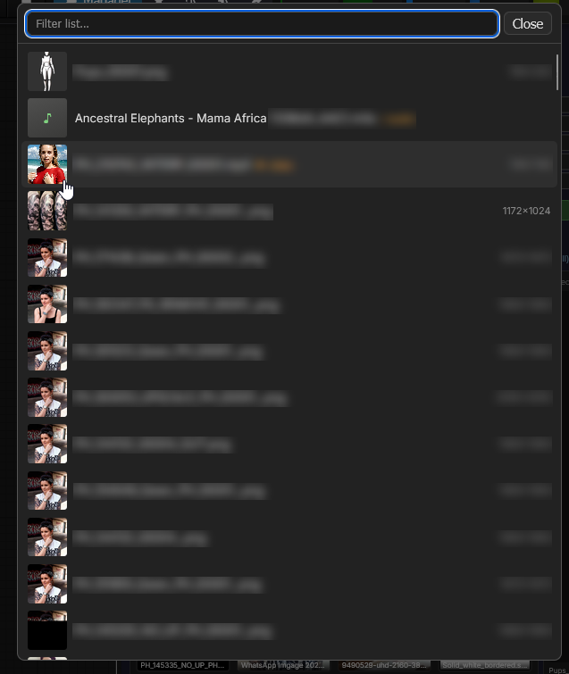

### Batch checkmarks

Every tile also carries a **circle checkmark**. Checking circles collects
files for **batch mode** (see section 5) **without changing the currently
loaded file** — the Selection panel stays where it was. The count is
shown at the end of the hint line above the grid. Keyboard shortcuts work
on the whole folder:

- **Ctrl+A** — check all
- **Ctrl+X** — uncheck all
- **Ctrl+I** — invert the checks

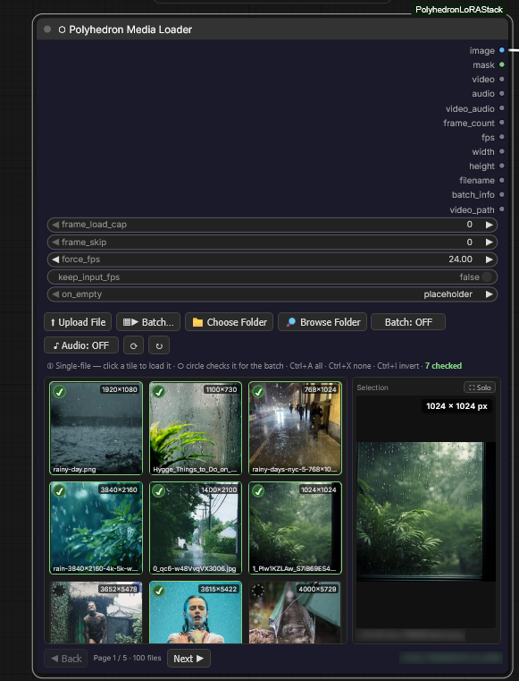

### ⛶ Solo view

**⛶ Solo** on the Selection panel hides the tile grid and lets the
selection fill the whole node, like a plain load node — for judging a
file properly before committing to it. The node size is remembered **per
mode**, so you can keep Solo large and the tile view compact. The button
turns into **⬛ Tiles** to bring the grid back.

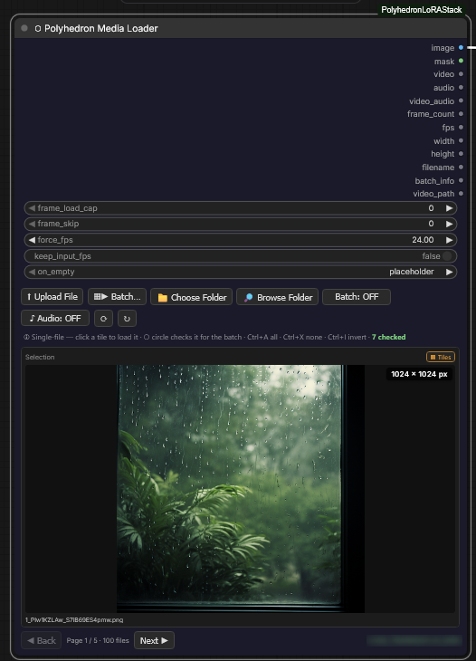

## 3. Video

Pick a video tile and the Selection panel turns into a **video preview**
with a trim pane underneath. The `video` output carries the trimmed clip;
`frame_count`, `fps`, `width` and `height` describe what actually comes
out.

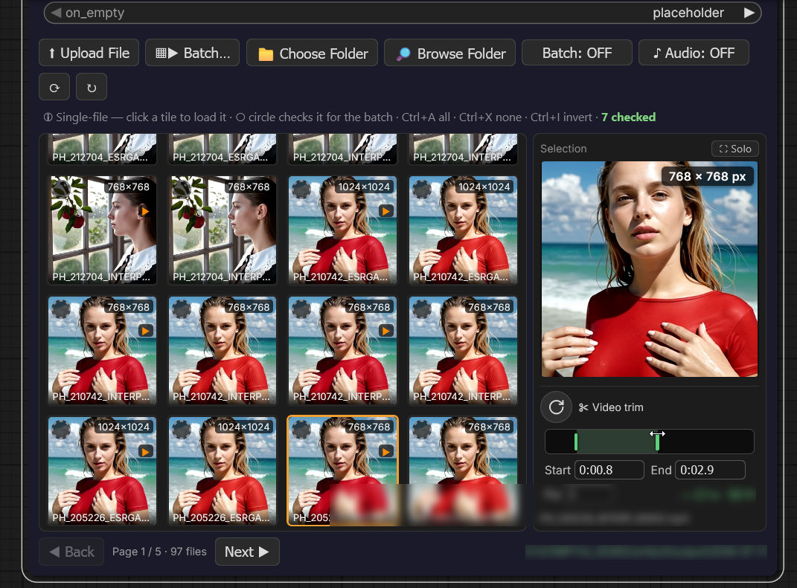
<!-- source: 2026-07-19_08_41_19 — handles pulled inward, dimmed edges,
     Start 0:00.8 / End 0:02.9, readout "-> 2.1 s · 50 fr" -->

### Trimming

The pane below the preview is headed **✂ Video trim**:

- The **track** represents the whole clip. Drag the two **handles** to set
  the kept range — the kept zone stays lit, the trimmed-away parts dim
  out.
- **Start** and **End** are editable timecode fields (`0:00.8`); typing
  and dragging drive each other, so you can dial an exact in-point and
  then nudge the out-point by hand.
- The **round button** left of the label plays the selection **on a
  loop**, following the handles live while you drag them.
- The **length readout** on the right shows the kept range in both
  currencies — seconds and frames (`-> 2.1 s · 50 fr`).

Trim positions snap to real frame boundaries — the grid is 1/native fps,
the very cut the backend makes, so the preview shows what the node hands
on.

### Fixed-length windows

Click the length readout and the window **locks**: the readout turns
amber and shows a padlock. From then on **the length is the law** —
dragging a handle or the kept zone **slides the window** through the clip
instead of resizing it, and the window always stays fully inside the
clip. The **Fix** field next to Start/End sets the locked length
numerically, in frames (`fr`). Click the readout again to unlock.

This is the tool for cutting many clips to the exact same length: pin a
folder, click through the videos, slide the fixed window to the good part
of each.

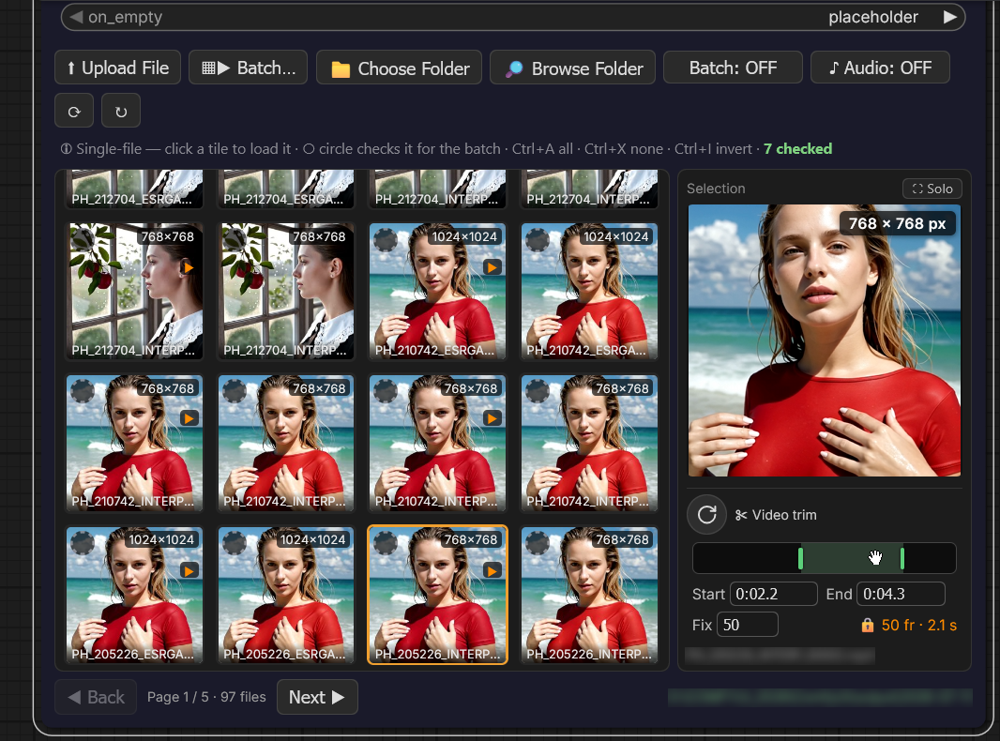

### Frame knobs

Four widgets on the node body decide how the video reaches the graph:

| Widget | Effect |
| --- | --- |
| `frame_load_cap` | Video only: maximum number of frames to load. `0` = all (with a safety cap). |
| `frame_skip` | Video only: skip this many frames at the start. |
| `force_fps` | Output fps, default `24`. `0` = the file's native fps. Sets the play rate — and the frame count when a still is expanded to the length of trimmed audio. |
| `keep_input_fps` | On: ignore `force_fps` and use the source's native fps (a still or sequence falls back to 24). Off: `force_fps` applies. |

### When there is nothing to load

`on_empty` decides what happens when there is genuinely nothing to hand
on — no selection, an empty or empty-filtered folder, a file that
vanished from disk:

- **`placeholder`** (default) emits a built-in placeholder frame, so a
  half-built graph keeps running.
- **`error`** stops the run instead.

Misconfiguration and decode failures always error, in both settings.

## 4. Audio

Audio is a **third media kind** in the grid: audio files show up as
tiles, are selectable and previewable, right next to images and videos.

### Pairing

Clicking an audio tile **pairs** that file with your current visual and
arms the **♪ Audio** button. Audio is not an exclusive mode — the visual
stays loaded, the audio rides along:

- **♪ Audio: ON** reveals the audio companion pane in the Selection: the
  file name, the folder it came from, a **waveform**, a small transport
  (play button with the running time and a volume control) and the trim
  strip. An **✕** button drops the pairing. Turning it on jumps the grid
  to the audio's folder, where it shows marked — the visual selection is
  marked in orange, the audio selection in green, so you can see both
  slots at once. Audio tiles carry a **waveform thumbnail** and a ♪
  badge, so a music folder reads at a glance.
- **♪ Audio: OFF** sets the companion aside. The pairing is
  **remembered**, so you can hide it and bring it back without picking
  again.
- When the audio lives in a different folder than the one you are
  browsing, a **📁 button** in the pane jumps the grid over to it.
- Selecting a **video** arms its own **embedded track**, labelled
  `· from video` in the pane. No separate file needed to keep a clip's
  sound.

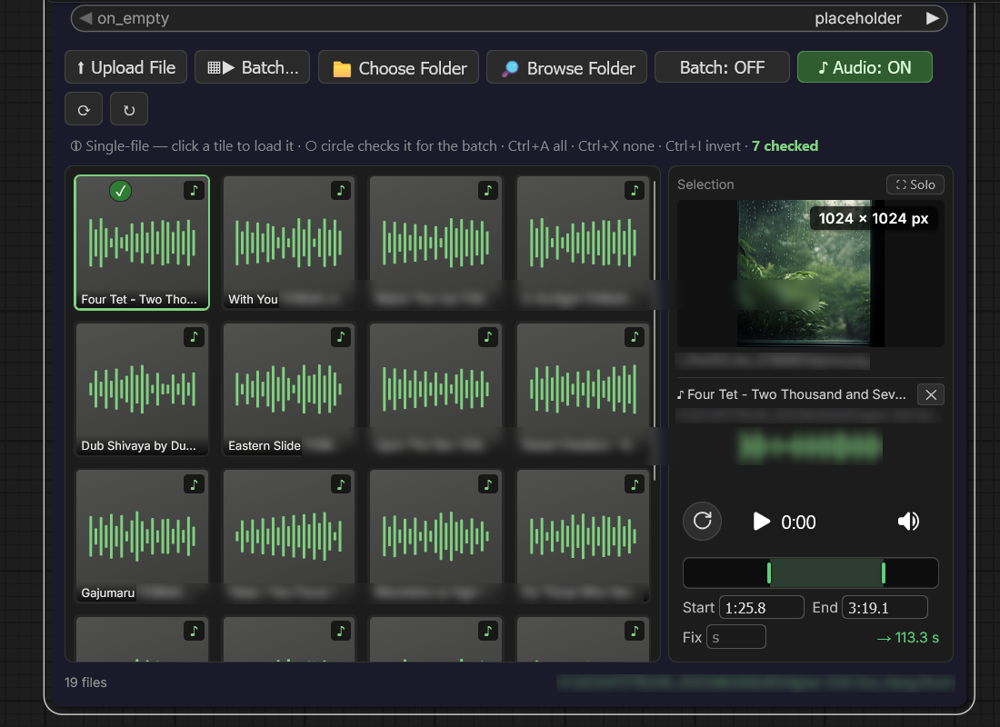

### Trimming audio

The companion pane carries the same trim strip as the video pane: track,
two handles, editable in/out fields, loop play and the length readout.
Two differences:

- Audio snaps to **tenths of a second** instead of frame boundaries, and
  its **Fix** field is in seconds (`s`) where the video's is in frames
  (`fr`).
- The **fixed-length window** works exactly as it does for video — click
  the readout to lock, then slide the window through the track.

Pair audio with a **video** and both panes stack under the preview: the
video trim on top, the audio companion below, each with its own handles,
fields and readout. Trimming one does not disturb the other.

The video and audio trim handles follow the same window rules, so a clip
and its sound stay in agreement.

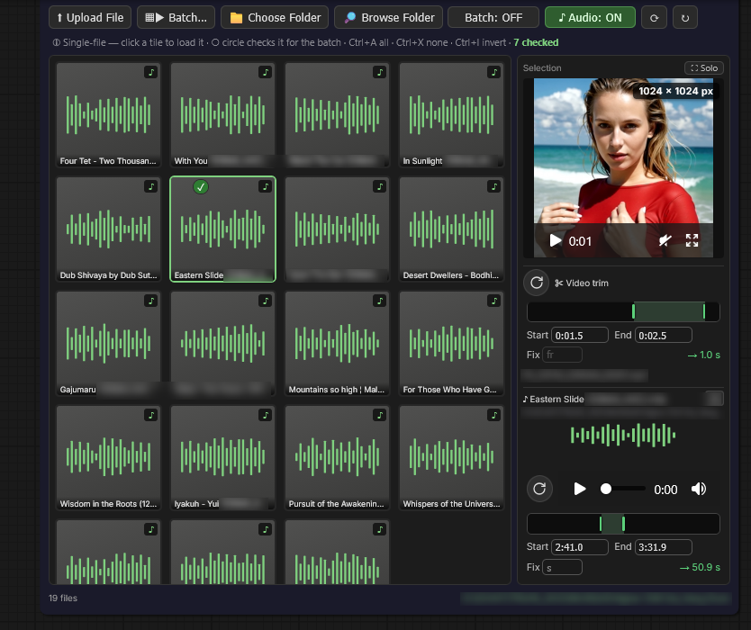
<!-- source: 2026-07-19_08_54_46 — video trim 0:01.5–0:02.5 ("-> 1.0 s", Fix in fr)
     above the audio pane 2:41.0–3:31.9 ("-> 50.9 s", Fix in s) -->

### Who has the upper hand

When a visual and an audio are paired, one of them sets the length. The
rule is not "whichever is shorter" — it depends on what the visual is:

| Pairing | Who wins | What happens |
| --- | --- | --- |
| Visual only, no audio | — | Nothing is re-timed. A still stays one frame, a video keeps its frames. |
| **Still + audio** | **the audio** | The audio is the law: the still expands into a real clip of the trimmed audio's length. `force_fps` sets the rate, and the audio is fitted to the exact frame count so the two end together. A very long track is cut at a hard frame cap — the console says so and asks you to trim shorter. |
| **Video + audio** | **the video** | The video is the law: its frames are kept untouched and the **audio is capped or silence-padded to the video's duration**. A short track is padded with silence to the end, a long one is cut. |

So a still bends to the sound, and sound bends to a real video. The
picture never gets stretched or dropped to fit a track.

### Which trim drives which output

The two trim panes are independent while you work, but they do not feed
the outputs in the same way:

- **`audio`** always carries **its own** trim window — the one you set in
  the audio pane. It stays independent no matter what the video does.
- **`video`** carries the **video** trim. When a video is trimmed, the
  clip is re-encoded from the sliced frames and takes the file's **own**
  sound track, cut to the same window, so it stays self-contained and in
  sync.
- **`video_audio`** (the muxed clip) follows the **video trim as
  master**: the paired audio is sliced to the *same* window the frames
  use and fitted to the trimmed duration. Your separate audio-trim
  handles do not shift the muxed clip out of sync. In every other case —
  still, untrimmed video, image batch — the muxed clip simply takes the
  trimmed paired audio.

Short version: **the video trim is the master lever for the muxed clip,
and the audio trim owns the standalone audio output.**

### What comes out

- **`audio`** hands on the decoded, trimmed audio. Decoding goes through
  PyAV — the same path ComfyUI's own audio loader uses — so m4a, aac and
  opus work without backend gaps.
- **`video_audio`** hands on the visual's frames **muxed with the paired
  audio**: wire it into a video save node for an mp4 with a sound track.
  It is `None` when nothing is paired.

An **audio-only** selection still emits a small placeholder frame on the
`image` output, so a graph that expects an image keeps running.

## 5. Batch

Batch mode answers two questions in order: **which** files run, and
**how** they run.

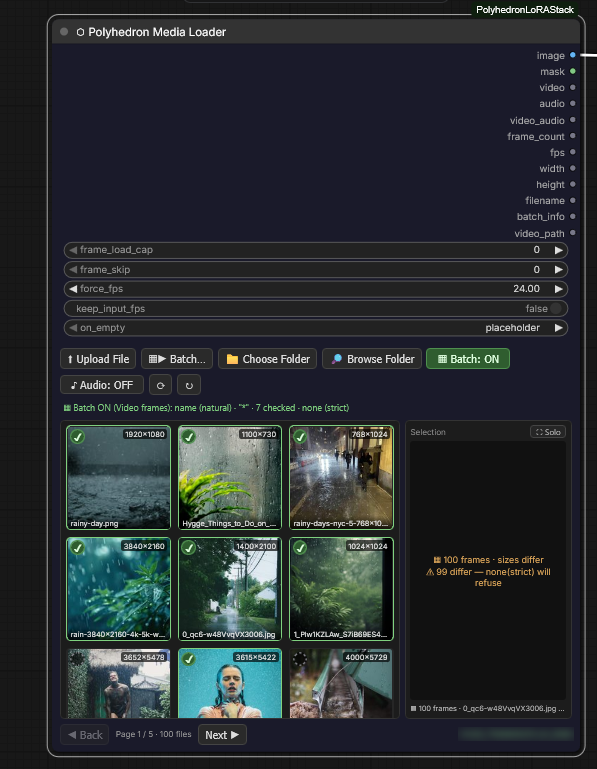

**Which** — the circle checkmarks from section 2. Checks are remembered
in the workflow. **How** — the **▦▶ Batch…** button opens the batch
panel; **Apply** arms it, and the **Batch** button on the node turns it
on and off afterwards without losing the checks. While it is armed, a
status line above the grid spells the whole configuration out.

### The batch remembers — even while you are somewhere else

The checked set and the source folder are **not** tied to what you are
currently browsing. You can turn the batch **OFF**, wander into a
completely different folder, load other files — the hint line keeps
showing the count (e.g. `10 checked`) the whole time, because those
checks still exist and still belong to their source folder.

Click **Batch: ON** and the grid **jumps straight back to the source
folder**, with the checked frames marked — you are looking at exactly
what will run, no matter where you were a moment ago. Turning it off
returns you to browsing without touching the checks.

So the mental model is: **the checks live with their folder, not with
your current view.** The count in the hint line is a reminder that a
prepared batch is waiting, and the Batch button is the way back to it.

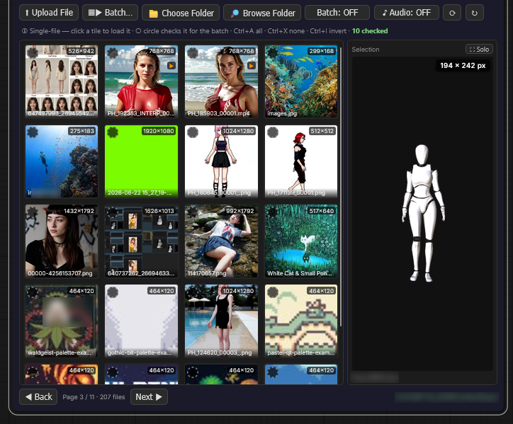

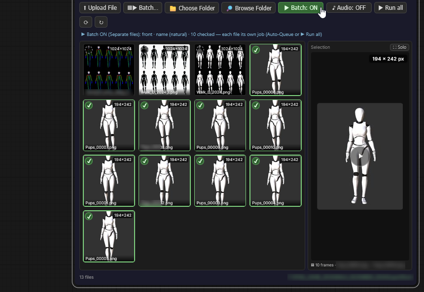

### The two modes

| Mode | What it does |
| --- | --- |
| **▦ Video frames** | The checked images are the frames of **one** video and load as a single batch, after a size check. |
| **▶ Separate files** | Each checked file — image or video — is **its own job**, fed in one per run. Auto-Queue or the **▶ Run all** button sweeps through them. |

### Picking the set

- **Folder** — the batch source, with buttons to open it in the file
  manager or choose a different one. **This is a pin of its own**: it does
  not follow the folder you are browsing in the grid. Point it at the
  folder you want to batch, or the panel keeps running on whatever it was
  set to last.

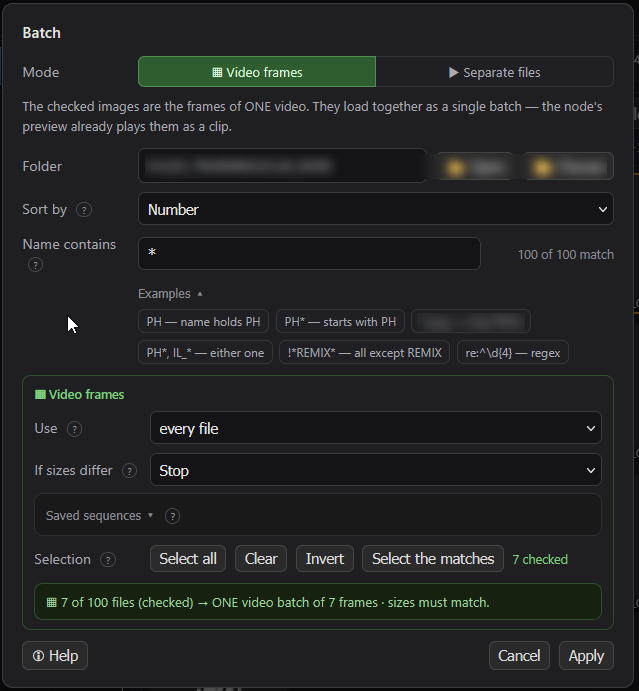
- **Sort by** — **Number** (natural order, so `img2` comes before
  `img10`), **A–Z** (literal character order), **Date modified** or
  **Date created**, oldest first.
- **Name contains** — plain text matches any name holding it, `*` means
  all files. The **Examples** row fills in the richer syntax: `PH*`
  (starts with), `*.png` (only PNGs), `PH*, IL_*` (either), `!*REMIX*`
  (exclude), `re:^\d{4}` (regex). **Select the matches** checks exactly
  the files the filter finds.

### ▦ Video frames options

- **Use every Nth file** — thin the batch out: every 2nd halves it,
  every 3rd thirds it, or set a custom N.
- **If sizes differ** — what to do with mismatched frames: **Stop**
  (refuses to run and names the odd one out), **Stretch** (resize
  everything to the first frame's size), **Letterbox** (pad with bars,
  nothing squashed) or **Crop center**.
- **Saved sequences** — build the current batch into a renumbered copy
  under `output\PLS_sequences` and load it as the active batch. Your
  original files are never touched. Saved sequences can be re-loaded or
  deleted from the same row.

### ▶ Separate files options

- **Begin at file** — which file of the set goes first; **Apply** sends
  the cursor back to it.
- **Start over after the last file** — on, the cursor wraps around to
  the first file; off, it stays parked on the last one.

### Running the set — one press vs. ▶ Run all

The part that is easy to misread: in Separate-files mode **one queue press
= one file**. Each normal ComfyUI queue run feeds exactly the file under
the cursor into the graph and then advances the cursor — pressing queue
once and seeing a single output is the mode working as designed, not a
stall.

To work through the whole set in one go, use **▶ Run all** — the button
appears in the node's toolbar only while the batch is armed (`Batch: ON`).
One press queues every remaining file as its own run.


Note the difference between the two batch modes here: a **Video frames**
batch is ONE clip and runs through ComfyUI's own Run/Queue button like any
other graph execution — there is nothing extra to press on the node. The
Separate-files sweep is **not** started from ComfyUI's Run button; it is
started from the node's own **▶ Run all**. While the sweep is going, the
node's hint line counts along:

> `▶ Batch (Processing): queued 10 runs — sweeping…`

That line is the confirmation that the set is actually being worked
through. When the sweep finishes, the cursor parks after the last file —
or wraps back to the first, if *Start over* is on.

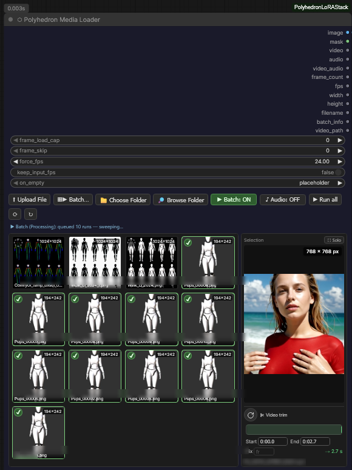

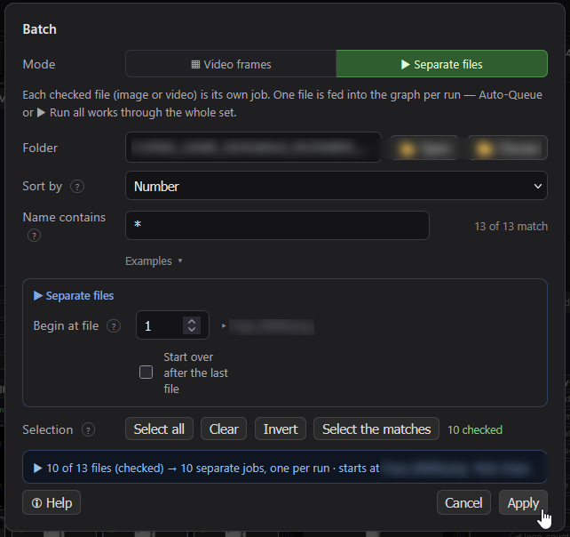
<!-- source: 2026-07-19_09_32_21 — proc block with Begin at file, wrap option,
     Selection row and the live line "10 of 13 files (checked) -> 10 separate jobs" -->

### What the graph sees

- **`batch_info`** is a live counter for a wired text node: `Batch 0023
  / 1334` per firing in Separate-files mode, `Batch 1334 frames (one
  pass)` for an image batch, and `Single: <name>` outside batch mode.
- **`video_path`** hands on the full path of the source file — the Batch
  Pipeline Source node consumes it. It is empty in modes without a
  single source file (image batch, sequence).

A synthesized image-batch video has no native frame rate. With
`force_fps` at `0` it falls back to 16 fps, matching the WAN
text-to-video convention this pack is built around.

## 6. Outputs & masks

The full pin table lives up front in *At a glance — every output pin*.
This section covers the part that is genuinely this pack's own: the mask
conventions and the round trip.

### The mask rules

- **Alpha convention** (matching core LoadImage): **opaque → 0,
  transparent → 1**. A still with a real alpha channel carries it as the
  mask.
- **A grayscale still IS a mask**: a mode-L image without alpha carries
  its **luminance** as the mask, **white → 1**. That is deliberately the
  inverse reading — a saved mask is white-on-black, and this rule makes
  it survive the round trip (below).
- **Video**: a plain video gets a blank (all-zero) mask. An
  **alpha-bearing video** — VP9-alpha WEBM, ProRes 4444, transparent
  GIF — is decoded through PyAV so the alpha becomes a **real per-frame
  mask**; without PyAV the node says clearly what to install instead of
  failing obscurely.

### The Save → Load round trip

The Save node closes the loop:

- Wire **only a mask** into Save and the mask itself is written as
  **grayscale stills** (mode L, white = mask on) — one file per batch
  entry, with the same naming, metadata and preview machinery as normal
  images.
- Load such a file back and the grayscale rule above turns it into the
  identical MASK again. **What Save writes, the Loader reads back** —
  masks included.

### The two-loader idiom

Because a saved mask is just a file, guided background removal becomes a
folder workflow: one loader carries the **images**, a second loader
carries the **masks** (the grayscale stills Save wrote), and the removal
node takes both. Edit a mask in any painting tool, drop it back into the
mask folder, ⟳ re-read — the correction flows through without any
in-graph mask surgery.

## 7. Polyhedron Save

One output node for stills, image sequences, videos (with muxed audio)
and masks. It picks the writer from what is actually wired to it, embeds
the workflow so the file can be dragged back into ComfyUI — and when it
writes a clip it drops a **still frame beside it as a control image**,
because an .mp4 cannot carry a workflow but a PNG can.

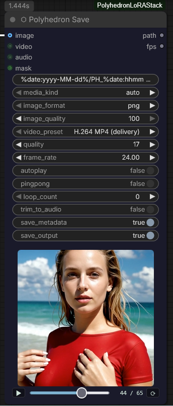

### Inputs and outputs

| Pin | Direction | Carries |
| --- | --- | --- |
| `image` | in | Still(s) or video frames `[N,H,W,3\|4]`. |
| `video` | in | A native VIDEO — frames, audio and fps ride through. Takes the loader's `video` **or `video_audio`** output alike: a `video_audio` wire carries its trimmed companion track along, muxed into the written clip. |
| `audio` | in | Optional: muxed with image frames, or **replaces** a wired video's audio. |
| `mask` | in | Optional alpha `[N,H,W]` (opaque → 0) for png/webp stills and alpha-capable presets (ProRes 4444). **Wired alone**, the mask itself is saved as grayscale stills (section 6). |
| `path` | out | The full path of the written file. |
| `fps` | out | The rate the clip was written at. |

### What gets written — `media_kind`

`auto` infers from the wiring: a **VIDEO** input → video; **IMAGE +
audio** (or an fps) → video; **IMAGE alone** → image; **AUDIO alone** →
audio; **MASK alone** → grayscale mask stills. Or force `image` /
`video`.

### Naming files and folders — the token table

`filename_prefix` is a **path**, not just a name: every `/` creates a
subfolder under `ComfyUI/output/`, and tokens are expanded before the
path is built. All the pieces:

| Piece | Writes | Example |
| --- | --- | --- |
| plain text | itself | `Polyhedron` → `Polyhedron_00001_.png` |
| `/` | a subfolder level | `renders/test` → `output/renders/test_00001_.png` |
| `%date:yyyy%` | 4-digit year | `2026` |
| `%date:yy%` | 2-digit year | `26` |
| `%date:MM%` | month (01–12) | `07` |
| `%date:dd%` | day (01–31) | `19` |
| `%date:hh%` | hour (00–23) | `10` |
| `%date:mm%` | minute | `29` |
| `%date:ss%` | second | `36` |
| `%width%` / `%height%` | frame size in pixels | `1024` |
| `%Node.widget%` | another node's widget value (expanded by ComfyUI core) | `%KSampler.seed%` |

Date letters combine freely inside one token — `%date:yyyy-MM-dd%` gives
`2026-07-19`, `%date:hhmm%` gives `1029`. **Uppercase `MM` is the month,
lowercase `mm` the minute.** A counter (`_00001_`) is always appended,
so files never overwrite each other.

Put together, patterns like these sort themselves:

| Pattern | Result |
| --- | --- |
| `%date:yyyy-MM-dd%/PH_%date:hhmmss%` | one folder per day, files stamped to the second: `output/2026-07-19/PH_102936_00001_.png` |
| `runs/%width%x%height%/frame` | grouped by resolution: `output/runs/1024x1024/frame_00001_.png` |
| `%date:yyyy%/%date:MM%/clip` | year/month tree: `output/2026/07/clip_00001_.mp4` |

Illegal path characters are stripped per segment (a stray `:` can never
break the path on Windows), traversal segments (`..`) are dropped, and
an empty result falls back to `Polyhedron`.

### Stills

- `image_format` — **png** (lossless, embedded workflow, drag back to
  reload), **webp** (smaller; `image_quality` 100 = lossless), **jpg**
  (no alpha).
- `image_quality` — webp/jpg only; png is always losslessly compressed.

### Video presets

| Preset | Container | For |
| --- | --- | --- |
| H.264 MP4 (delivery) | .mp4 | Small, universal — ComfyUI's own tested writer. |
| H.265 MP4 (delivery, grain) | .mp4 | 10-bit HEVC, grain-tuned so particles and gradients are not smeared by HEVC's default in-loop filters. |
| ProRes 422 HQ (master) | .mov | 10-bit edit/archive master, intra (every frame a keyframe). |
| ProRes 4444 (master + alpha) | .mov | The alpha-capable master — the wired mask rides along. |
| FFV1 (lossless archive) | .mkv | Mathematically lossless, FLAC audio. |
| WebM VP9 | .webm | Web delivery, Opus audio. |
| Animated WebP / GIF | .webp / .gif | Loops; `loop_count` (0 = forever). |

The masters encode through bundled PyAV with a 16-bit intermediate, so
the diffusion float precision reaches the encoder — less banding.
`quality` is crf-style for the lossy presets (~17–20 is visually
lossless); ProRes/FFV1 ignore it.

### The remaining levers

| Widget | Effect |
| --- | --- |
| `frame_rate` | fps when a video is built from an IMAGE batch; a wired VIDEO keeps its own rate. Convertible to an input — wire Interpolate's fps output here. |
| `autoplay` | In-node preview: off = first frame with play controls; on = plays automatically, muted. |
| `pingpong` | Appends the reversed frames for a seamless boomerang loop. |
| `loop_count` | GIF / animated-WebP loops, 0 = forever. |
| `trim_to_audio` | Cuts the longer of clip and audio so both end together. |
| `save_metadata` | Embeds workflow + prompt (PNG text / MP4 metadata). |
| `save_output` | On: write to `ComfyUI/output/`. Off: temp dir — preview only, keeps output/ clean while iterating. |

---

# ⬡ Polyhedron LoRA Stack

**Group-aware LoRA management for ComfyUI — built for workflows that run 10–25 LoRAs at once.**

Most LoRA loaders are fine for two or three LoRAs. Stack fifteen and you get the familiar
multi-LoRA interference: washed-out detail, concepts cancelling each other, no way to see what is even active.
Polyhedron LoRA Stack treats a big LoRA stack like a total-conversion mod for your model —
organised in semantic groups, applied in a defined order, with per-group merge modes and two
cleanup switches that fight that interference directly.

Model-agnostic backend: WAN 2.1 / 2.2, FLUX, SDXL, SD 1.5 — no model-specific assumptions.


---

## Highlights

- **Group system** — `acc → style → scene → motion → subject → detail → custom`, applied broad-to-specific, with optional per-group ordering
- **Per-group merge modes** — Sequential (SEQ), Combined (CONCAT), Smooth Mix (DARE) with Channel-Drop and Element-Drop variants; deterministic seeds, reproducible runs
- **Cleanup switches: Trim & Resolve** — magnitude-based channel pruning and TIES sign-election against multi-LoRA interference (see below)
- **⬡ Merge Analyzer** — a passive node that shows what is actually being merged and measures the Resolve repack fidelity (energy, cosine, amplitude)
- **Thumbnails & previews** — hover popups with image/video, Civitai hash-based fetch (SFW-strict), editable metadata
- **Trigger-word management** — read from `.uls-meta.json`, `.txt` or the safetensors header, one-click insert into your prompt node
- **Quality-of-life** — Token Counter for WAN's 512-token limit, trigger Inspector, central Model Switch, dual HIGH/LOW workflow support, fast cancel via ComfyUI's red ✕
- **Persistent settings** — group assignments, modes and cleanup toggles are serialized into the workflow and survive reloads and full ComfyUI restarts

---

## The nodes

| Node | Purpose |
|---|---|
| ⬡ Polyhedron LoRA Stack | Main node: group-organised LoRA rows, per-group merge modes, cleanup switches |
| ⬡ Polyhedron LoRA Engine | Companion for acceleration LoRAs (Lightning, FusionX, CausVid, LightX2V) — flat list, one global mode |
| ⬡ Polyhedron Merge Analyzer | Passive: live overview of the configured merge + Resolve fidelity measurement |
| ⬡ Polyhedron LoRA Inspector | Passive: checks the trigger words of all active LoRAs against your prompt |
| ⬡ Polyhedron Token Counter | UMT5-XXL token estimate vs. WAN's hard 512-token limit, with actionable report |
| ⬡ Polyhedron Select Model Switch | Central model selector (6 slots), docks onto any COMBO loader input |
| ⬡ Polyhedron Wan Bridge (→ / ←) | Type bridges MODEL ↔ WANVIDEOMODEL for kijai's WanVideoWrapper |
| ⬡ Polyhedron Wan Frame Inflate / Pick Frame | Workaround for kijai issue #1827 (T2I LoRAs without effect) |
| ⬡ Polyhedron Sigma Curve / Dual Sigma Curve | Model-agnostic SIGMAS generators; Dual = HIGH/LOW split with exact handoff |
| ⬡ Polyhedron Noise Schedule | Deprecated original sigma node, kept for backwards compatibility |

---

## Merge modes (per group)

- **Sequential (SEQ)** — classic stacking via ComfyUI's native cached loader. Default, always works.
- **Combined (CONCAT)** — rank concatenation; mathematically identical to SEQ, gentler float path.
- **Smooth Mix (DARE)** — CONCAT plus a Bernoulli mask. *Channel Drop* removes whole rank
  channels (LoRA-aware), *Element Drop* removes single tensor elements (classic DARE paper).
  Density auto-scales with group size; the seed is derived deterministically from LoRA names
  and weights, so the same workflow always produces the same merge.

## Cleanup switches — Trim & Resolve

Two independent modifiers on top of CONCAT/DARE (greyed out under SEQ, where they cannot apply):


- **Trim — keep strongest.** Deterministically drops each LoRA's weakest rank channels
  (by contribution magnitude) *before* merging. This is the direct counter to the
  "many quiet LoRAs → grey fog" effect. Strength is adjustable per group
  (`Auto · Gentle 90% · Light 80% · Medium 70% · Strong 60% · Max 50%`).
- **Resolve — resolve conflicts.** TIES sign-election across competing LoRAs: per weight,
  the majority direction wins and only agreeing LoRAs are averaged, then the result is
  repacked to low-rank via truncated SVD so it hits the same hand-off path.

> **Recommended Trim working range: 70–80 % (Medium/Light).** `Max · 50%` cuts into the
> mid/quiet rank channels where a concept's *distinguishing features* live — the known
> failure mode is concept → silhouette, with the base model filling the gap with its own
> prior. Use Max only on extreme stacks (15+) and check the output visually.
> The Merge Analyzer warns about this in its report when Trim is active.

All toggle states and the Trim strength **persist**: they are saved into the workflow and
restored after reload and full ComfyUI restarts.

## ⬡ Merge Analyzer

A passive measurement node — connect `uls_config_out`, no model patching. **Overview** is
instant (groups, LoRAs, weights, modes, cleanup status); **Deep analysis** loads the LoRAs
and measures the Resolve repack per layer (energy at 1×/2×/4× rank, cosine, amplitude ratio),
with live progress in the console. Use one Analyzer per Stack (HIGH + LOW).


---

## Per-row CLIP strength (v302)

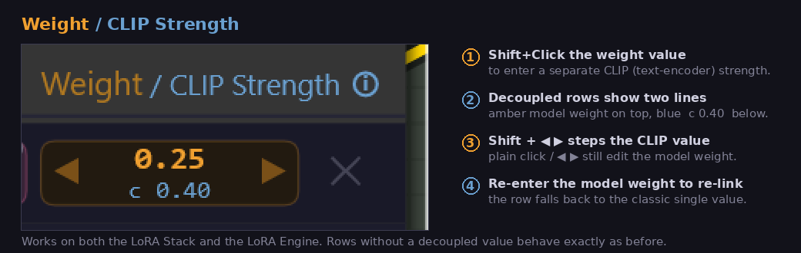

By default a row's CLIP (text-encoder) strength follows its model weight —
exactly as before. To decouple them:

1. **Shift-click** the weight value and enter a separate CLIP strength.
2. The cell switches to two lines: the amber model weight on top, the blue
   CLIP strength (`c 0.40`) below.
3. **Shift + ◀ ▶** steps the CLIP strength; a plain click / ◀ ▶ still edits
   the model weight.
4. Entering the model weight again **re-links** the row to the classic
   single value.

Hover the `Weight / CLIP Strength` column header for an in-node reminder.
This works identically on the **LoRA Stack** and the **LoRA Engine**. Only relevant for models whose LoRAs carry text-encoder keys (SDXL,
SD 1.5, …) — WAN LoRAs have none, so WAN workflows are unaffected. In merged
modes (CONCAT/DARE) the text-encoder layers are scaled with the CLIP strength
inside the same one-pass merge; DARE/RESOLVE seeds stay derived from the model
weights, so existing results are bit-identical until you actually decouple a
row.

## Compatibility

**Renderer:** the Stack and Engine UIs are hand-drawn on the classic LiteGraph
canvas. ComfyUI's new Vue renderer ("Modern Node Design" / Nodes 2.0) does not
draw this kind of custom UI — the same limitation applies to other canvas-based
packs such as rgthree-comfy. If a Stack/Engine node appears empty, disable
Modern Node Design in Settings; the node shows this hint inline and a one-time
notice explains it. Your rows and settings are safe either way — only the
rendering is affected, and all backend nodes (Bridge, Sigma, Token Counter,
Inspector, Model Switch) work under both renderers.

## Installation

**ComfyUI-Manager (recommended):** open the Manager, search for **"Polyhedron Suite"**
(the package id stays `polyhedron-lora-stack`, so an existing install updates in
place) and install. Missing-node detection in shared workflows resolves through the
[Comfy Registry](https://registry.comfy.org) entry as well.

**comfy-cli:**
```bash
comfy node install polyhedron-lora-stack
```

**Manual:**
```bash
cd ComfyUI/custom_nodes
git clone https://github.com/PolyhedronAI/ComfyUI-PolyhedronLoRAStack.git
# Restart ComfyUI
```

**Dependencies: none.** The nodes run on what ComfyUI already ships. `Pillow` and `requests`
are only needed for the optional standalone CLI preview generator (`uls_preview_gen.py`):
```bash
pip install Pillow requests
```

---

## Dual-noise workflow pattern (WAN 2.2)

Use **two Stack nodes side by side** — one per noise path — and configure both identically:

```
[UNet HIGH] → [Engine HIGH] → [Stack HIGH] → [Sampler HIGH]
[UNet LOW]  → [Engine LOW]  → [Stack LOW]  → [Sampler LOW]
```

The same single-line pattern works for FLUX, SDXL and SD 1.5.

---

## Example workflows

Four ready-to-load starter workflows ship in
[`example_workflows/`](example_workflows/) and appear in ComfyUI's template
browser (**Workflow → Browse Templates**) under this pack's name once it is
installed:

| Template | Sampler path | Accelerator engine |
|---|---|---|
| `polyhedron_lora_stack_ksampler_base` | native KSampler (Advanced), dual HIGH/LOW | off |
| `polyhedron_lora_stack_ksampler_lightning` | native KSampler (Advanced), dual HIGH/LOW | Wan2.2-Lightning v1.1, 8-step preset (4/4 split, CFG 1, shift 5) |
| `polyhedron_lora_stack_wanvideo_base` | WanVideoWrapper (kijai), dual HIGH/LOW | off |
| `polyhedron_lora_stack_wanvideo_accelerator` | WanVideoWrapper (kijai), dual HIGH/LOW | on |

Compact WAN 2.2 dual-noise graphs built around the Stack: a grouped canvas
(models → HIGH/LOW LoRA lanes → prompts → sampling → output, passive
diagnostics below), neutral prompts, fixed seeds. Stack and Engine rows ship
as **disabled examples** with showcase group modes pre-set — point them at
your local files or add your own. External packs needed: ComfyUI-KJNodes and
ComfyUI-Custom-Scripts (text display); the `wanvideo` variants additionally
need ComfyUI-WanVideoWrapper (use **Manager → Install Missing Custom Nodes**
after loading). The native variants load fp8 checkpoints through the core
UNETLoader — GGUF users swap in their GGUF loader. The `wanvideo` variants
point at GGUF Q8 files; the kijai #1827 single-frame workaround is
documented in-canvas (Frame Inflate ships bypassed for the GGUF default).

## Preview images and trigger words

Place files alongside your `.safetensors`:

| File | Purpose | Notes |
|---|---|---|
| `mylora.jpg` / `mylora.preview.png/.mp4/.gif` | Preview | Shown as thumbnail / hover popup |
| `mylora.txt` | Trigger words | One per line or comma-separated. Read-only. |
| `mylora.uls-meta.json` | Editable metadata | Created automatically when editing in the UI |

Trigger-word resolution priority:
`.uls-meta.json` (user-curated) → `.txt` → safetensors header → filename fallback.

"Fetch from Civitai" reads the `sshs_model_hash` from the safetensors header and pulls the
preview image and trigger words from the Civitai API (SFW-strict filtering, capped downloads).

---

## Local API routes

| Route | Purpose |
|---|---|
| `GET  /uls/list` | All LoRAs with preview flags |
| `GET  /uls/metadata?lora=<name>` | Per-LoRA metadata as JSON |
| `GET  /uls/preview/image` / `…/video` | Preview bytes (video with range support) |
| `GET/POST /uls/groups` | Group assignments |
| `POST /uls/triggers` | Save trigger words (writes `.uls-meta.json`) |
| `GET/POST /uls/group_modes` | Per-group merge modes |
| `POST /uls/civitai_fetch` | Hash-based Civitai preview + trigger download |

---

## Documentation

The full illustrated user manual ships in this repository:
[`docs/Polyhedron_Suite_Documentation_v362.pdf`](docs/Polyhedron_Suite_Documentation_v362.pdf)
— 58 pages in two parts:

- **Part I — Media Loader & Save** (21 pages): the two media I/O nodes, every
  panel, pin and switch, fully illustrated.
- **Part II — LoRA Stack** (35 pages): every Stack node, panel and switch.
  The per-row CLIP strength feature is section 3.13.

The Nodes 2.0 compatibility layer is described in the Compatibility section
above; the release history lives in `docs/changelog-archive/`.

## Links

- Civitai: <https://civitai.red/user/Polyhedron_AI>
- Patreon: <https://patreon.com/c/polyhedron_ai>

## License

Code: [MIT](LICENSE). The user documentation PDF in `docs/` is © Polyhedron, all rights reserved.
